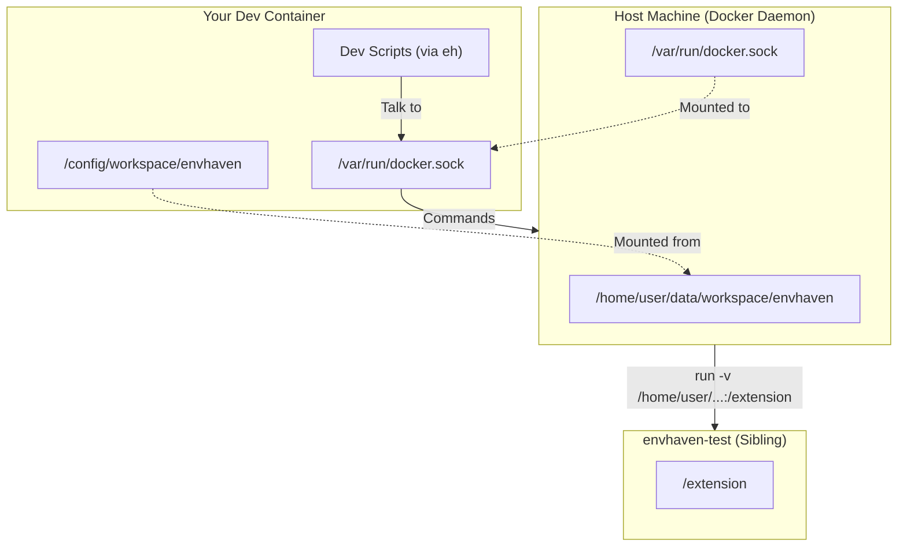

# Contributing to EnvHaven

Thank you for your interest in contributing to EnvHaven!

## Quick Start

```bash
git clone https://github.com/envhaven/envhaven.git
cd envhaven/dev
bun run setup   # Install, build, and link globally
eh              # Launch development TUI
```

Press `b` to build, `s` to start container, `t` to test.

## Prerequisites

- Docker 20.10+
- [Bun](https://bun.sh) 1.1+ (for extension, CLI, and dev TUI)
- Git

## Repository Structure

```
envhaven/
├── .github/workflows/    # CI/CD
├── cli/                  # Haven CLI (local editor + remote AI)
│   ├── src/              # TypeScript source
│   ├── scripts/          # Build scripts
│   ├── test/             # Unit tests
│   └── AGENTS.md         # Architecture docs
├── dev/                  # Development CLI (eh)
│   ├── scripts/          # Standalone scripts (source of truth)
│   │   ├── lib/          # Shared utilities
│   │   ├── build.ts      # docker build
│   │   ├── start.ts      # docker run
│   │   ├── test-*.ts     # Test scripts
│   │   └── README.md     # Script documentation
│   ├── src/              # TUI source (Ink/React)
│   ├── .env.example      # Config template
│   ├── AGENTS.md         # Dev tooling architecture
│   └── README.md         # Dev CLI docs
├── docs/                 # User documentation
├── extension/            # VS Code extension source
│   ├── src/              # Extension host
│   ├── webview/          # React webview
│   └── package.json
├── runtime/              # Packaged INTO Docker image
│   ├── scripts/          # s6-overlay init scripts
│   ├── overrides/        # code-server UI patches
│   └── templates/        # Config templates
├── Dockerfile
├── docker-compose.yml
└── eh                    # Dev CLI entry point
```

### Key Distinction

- **`runtime/`** — Files copied into the Docker image (runs inside container)
- **`dev/`** — Development TUI and scripts (runs on your machine)

## Development Workflow

### Using the Dev TUI

```bash
cd dev && bun run setup   # One-time: install, build, link
eh                        # Launch development TUI from anywhere
```

| Key | Action |
|-----|--------|
| `s` | Start Container |
| `b` | Build Image |
| `w` | Watch Extension (live dev) |
| `r` | Release (tag → Image + CLI) |
| `t` | Test → Image / CLI / Extension |
| `l` | View Logs |
| `x` | Shell (SSH into container) |
| `,` | Settings |

### Configuration

For custom settings (different ports, host IP, etc.):

```bash
cp dev/.env.example dev/.env.dev
# Edit dev/.env.dev
```

## Extension Development

The EnvHaven VS Code extension provides the sidebar panel. We use **Bun** for all JavaScript development.

### Live Development (Recommended)

```bash
eh    # Then press 'w' for Watch Extension
```

Edit files → watcher rebuilds → reload browser.

### Manual Development

```bash
cd extension
bun install
bun run dev              # Watch mode

cd webview
bun install
bun run build            # Build React webview
```

### Extension Commands

| Command | Description |
|---------|-------------|
| `bun run build` | Compile TypeScript |
| `bun run dev` | Watch mode |
| `bun run build:webview` | Build webview |
| `bun run package` | Create `.vsix` |

## Haven CLI Development

The Haven CLI is a Bun/TypeScript project.

```bash
cd cli
bun install
bun run dev connect .    # Run in dev mode
bun test                 # Run tests
bun run typecheck        # Type check
bun run build            # Build binary
```

See [cli/AGENTS.md](cli/AGENTS.md) for architecture.

## Making Changes

### Dockerfile Changes

The Dockerfile is organized into sections:

1. Extension build (Stage 1)
2. System dependencies
3. Runtime installations (Node.js, Python, Go, Rust)
4. AI tool installations
5. VS Code configuration
6. s6-overlay services

When adding new tools, follow existing patterns and add tests.

### Runtime Scripts

Scripts in `runtime/scripts/` run at container startup via s6-overlay:

| Script | Purpose |
|--------|---------|
| `init-extensions-run` | Install VS Code extensions |
| `init-vscode-settings-run` | Apply VS Code settings |
| `init-agents-md-run` | Generate AGENTS.md |
| `init-user-config-run` | Configure git, SSH, user shell |
| `init-zsh-config-run` | Configure zsh |
| `svc-sshd-run` | Run SSH daemon |

### Templates

- `runtime/templates/AGENTS.md.template` - Template for generated AGENTS.md
- `runtime/templates/settings.json` - VS Code settings

## Pull Request Guidelines

1. **Test your changes**
   ```bash
   # Via TUI
   eh   # Press 't' → select test type

   # Or run scripts directly
   bun dev/scripts/test-image.ts      # Validate image
   bun dev/scripts/test-extension.ts  # Test extension build
   bun dev/scripts/test-cli.ts --ci   # Test Haven CLI
   ```

2. **Update documentation** if adding features

3. **Keep commits focused** with clear messages

4. **Follow existing patterns** in the codebase

## Commit Convention (MANDATORY)

All commits **must** follow [Conventional Commits](https://www.conventionalcommits.org/en/v1.0.0/).

### Format

```
<type>[optional scope]: <description>

[optional body]

[optional footer(s)]
```

### Types

| Type | Description |
|------|-------------|
| `feat` | New feature |
| `fix` | Bug fix |
| `docs` | Documentation only |
| `style` | Formatting, whitespace (no code change) |
| `refactor` | Code change that neither fixes nor adds |
| `perf` | Performance improvement |
| `test` | Adding or correcting tests |
| `build` | Build system or external dependencies |
| `ci` | CI configuration |
| `chore` | Maintenance tasks |
| `revert` | Reverts a previous commit |

### Scopes

Common scopes for this project:

- `cli` - Haven CLI
- `extension` - VS Code extension
- `image` - Docker image / Dockerfile
- `dev` - Development tooling (eh TUI, scripts)
- `runtime` - Runtime scripts and templates

### Examples

```
feat(cli): add connect command
fix(extension): resolve sidebar crash on reload
docs: update contributing guide
build(image): add rust toolchain
chore: bump dependencies
```

### Rules

- Use lowercase for type and description
- No period at the end of description
- Keep description under 72 characters
- Use imperative mood ("add" not "added")
- Breaking changes: add `!` after type/scope (e.g., `feat(cli)!: change config format`)

## Code Style

- Shell scripts: Use `shellcheck` for linting
- TypeScript: Follow existing patterns
- Dockerfile: Comment each section, use multi-line for readability
- CLI TypeScript: Minimal comments, self-documenting code

## Reporting Issues

When reporting issues, please include:

- Docker version (`docker --version`)
- Host OS and architecture
- Steps to reproduce
- Expected vs actual behavior
- Relevant logs (`docker logs envhaven`)

## Developing from within a Container

You can develop EnvHaven while running inside a container (like EnvHaven itself, code-server, or a DevContainer). This is common for "dogfooding" the environment.

Since the development scripts (invoked by the `eh` TUI) need to spawn *sibling* containers (like `envhaven-test`) alongside your current container, you must configure **Docker-in-Docker (DinD)** via socket mounting.

### 1. Enable Docker Socket Access

Your development container must have access to the host's Docker socket.

**Docker Compose:**
```yaml
services:
  envhaven:
    volumes:
      - /var/run/docker.sock:/var/run/docker.sock
      # ... other volumes
```

**Docker CLI:**
```bash
docker run -v /var/run/docker.sock:/var/run/docker.sock ...
```

### 2. Configure Path Translation

The Docker daemon runs on the host system. When the dev scripts request to mount a volume (like `/config/workspace/envhaven/extension`), the daemon looks for that path on the **host**, not inside your container.

You must tell the scripts where the repository resides on the host filesystem.

1.  **Find the host path:**
    Run this *on the host machine* (or inspect via `docker inspect`):
    ```bash
    # Example: Inspect the container to see where /config is mounted from
    docker inspect envhaven --format '{{ range .Mounts }}{{ if eq .Destination "/config" }}{{ .Source }}{{ end }}{{ end }}'
    ```

2.  **Configure `dev/.env.dev`:**
    ```bash
    cp dev/.env.example dev/.env.dev
    ```

    Edit `dev/.env.dev`:
    ```bash
    # 1. Set the Host Path (Host's view of your repo)
    # If your repo is at /config/workspace/envhaven inside the container,
    # and /config is mounted from /home/user/data on the host:
    ENVHAVEN_HOST_REPO_PATH=/home/user/data/workspace/envhaven

    # 2. Set the Host IP
    # 'localhost' refers to the container itself. Use the host's IP for access.
    ENVHAVEN_HOST=192.168.1.50
    ```

### 3. Run the Dev TUI

Now you can use the `eh` TUI as normal (which invokes the configured scripts):

```bash
eh
```

- **Build (`b`)**: Builds the image using the host's Docker daemon.
- **Start (`s`)**: Starts a sibling container on the host.
- **Watch (`w`)**: Mounts the extension from the host path into the test container.

### Visualizing Path Translation




### Troubleshooting

**"Cannot connect to test container"**: Make sure `ENVHAVEN_HOST` is set to your host's IP address, not `localhost`. From inside a container, `localhost` refers to the container itself.

**"Extension not mounted"**: Verify `ENVHAVEN_HOST_REPO_PATH` is correct. The path should be what the Docker daemon sees, not what you see inside your container.

**Password issues**: Check `ENVHAVEN_PASSWORD` in `dev/.env.dev`. Default is `test`.

## Questions?

Open an issue for questions or join the discussion in existing issues.
